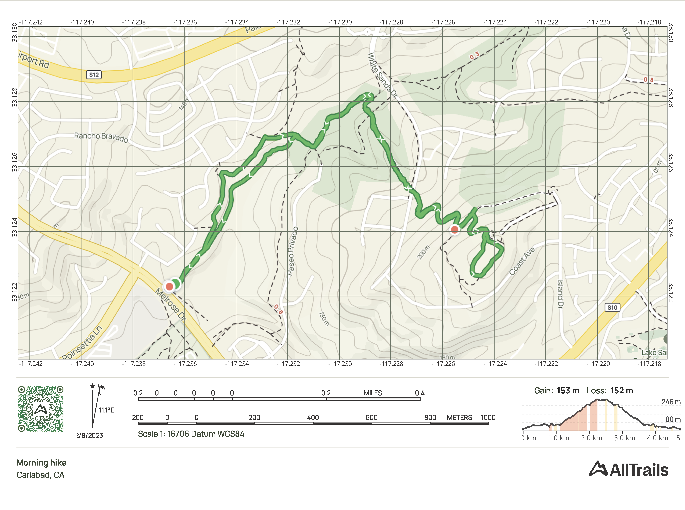

## Event Details

| 🗓️ Date   | 🕠 Time  | 📍 Starting Location                                                                                                                                                   |
|------------|----------|------------------------------------------------------------------------------------------------------------------------------------------------------------------------|
| 2023-02-09 | 05:30 AM | [Directions 🗺](https://goo.gl/maps/vGjpauDLWSHE6wX3A)  Park at the trailhead.  To reach come up from the south or plan a u-turn on Melrose coming from the north. |

- Q: Kook (Brennan Stout)
- Length: 4.81 km
- Elevation gain: 153 m
- Route type: Loop
- Don't forget your weight!
- Please bring headlamp.

### Fun Facts

- The trail goes from the City of Carlsbad to the City of San Marcos and back!
- The park at the top of the hill is grassy, open, an gives panoramic views west to the ocean and east to the mountains.

### Route Profile

